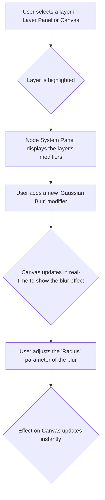

# Product Requirements Document: Mod-Weave Core

> **Generated Date**: 2025-11-25
> **Version**: v2.0
> **Status**: In Production

---

## 1. Overview

Mod-Weave Core is a next-generation, AI-powered design and motion graphics tool. It merges a non-destructive, node-based modifier system with a deeply integrated conversational AI (powered by Google's Gemini). The primary goal is to bridge the gap between static design and complex motion by providing an intuitive, visual, and intelligent workflow. Users can generate assets, apply complex effects, and create animations through a combination of direct manipulation and natural language commands.

### Core Product Pillars
*   **Non-Destructive Workflow**: The original layer asset is never altered. All operations—from color adjustments to AI-generated fills and physics simulations—are applied as nodes in a modifier stack.
*   **AI-First Integration**: Gemini is a core part of the workflow, used for asset generation, intelligent editing, layer analysis, and conversational assistance.
*   **Visual Programming**: The Node System Panel allows users to create sophisticated, procedural effects by stacking modifiers and visually wiring parameters together.
*   **Motion by Default**: The architecture is designed to make animating static layers as simple as applying a filter.

## 2. User Stories

*   **As a Motion Designer**, I want to quickly prototype complex visual effects without writing code, so I can iterate on creative ideas faster.
*   **As a UI/UX Designer**, I want to generate high-quality assets and variations using natural language, so I can focus on the overall design composition.
*   **As a Content Creator**, I want to easily add engaging animations and effects to my static images, so I can produce more dynamic content for social media.
*   **As a Developer**, I want to understand the system's architecture and component interactions, so I can extend its functionality with custom modifiers or integrations.

## 3. Core Features & Functionality

### 3.1. Main Interface Components
*   **Canvas**: The primary workspace for direct manipulation of layers. It provides real-time rendering of all layers and their applied modifiers.
*   **Layer Panel**: A hierarchical view of all layers in the scene. Users can select, reorder, and manage layers from this panel.
*   **Node System Panel**: The central hub for managing the modifier stack of the selected layer. Users can add, reorder, and connect modifiers visually.
*   **AI Chat Panel**: An interactive, conversational interface powered by Gemini. It allows users to execute commands, generate images, and get assistance.
*   **Command Palette**: A quick-access tool (Cmd/Ctrl+K) for searching and executing commands.

### 3.2. System Features
*   **Undo/Redo System**: A robust history stack that allows users to undo and redo up to 50 actions.
*   **Visual Parameter Wiring**: A node-based connection system that allows the output of one modifier to drive the input parameter of another.
*   **AI Function Calling**: The AI can intelligently translate natural language commands into concrete actions, such as adding a modifier or updating its parameters.
*   **Mobile Responsive UI**: The interface adapts to smaller screens with a tab-based navigation system for Layers, Nodes, and AI Chat.

## 4. Workflows

### 4.1. Basic Layer Editing Workflow



### 4.2. AI-Powered Image Generation Workflow

```mermaid
graph TD
    A[User opens AI Chat Panel] --> B[User types: "Create an image of a futuristic city skyline"];
    B --> C{System sends prompt to Gemini API};
    C --> D[Gemini returns a generated image];
    D --> E{A new image layer is added to the Canvas};
    E --> F[The new layer is automatically selected];
```

### 4.3. AI-Assisted Node Manipulation Workflow

```mermaid
graph TD
    A[User selects the 'Cyber Orb' layer] --> B[User opens AI Chat Panel];
    B --> C[User types: "Make the neon glow twice as intense"];
    C --> D{AI analyzes the request and identifies the 'Bloom' modifier};
    D --> E[AI executes an `update_modifier_params` action on the 'Bloom' modifier];
    E --> F{The 'Intensity' parameter is updated};
    F --> G[Canvas shows the orb with a brighter glow];
```

## 5. Technical Specifications

### 5.1. Frontend Architecture
*   **Framework**: React 19.2.0 with TypeScript 5.8.2
*   **Build Tool**: Vite 6.2.0
*   **State Management**: React Hooks (`useState`, `useEffect`) for local component state and a centralized history stack in `App.tsx` for global state.
*   **Styling**: Tailwind CSS for utility-first styling.

### 5.2. AI Integration
*   **Service**: Google Gemini Pro
*   **API Client**: `@google/genai` v1.30.0
*   **Key Functions**:
    *   `gemini-3-pro-image-preview`: Used for text-to-image generation.
    *   `gemini-2.5-flash-image`: Used for image editing tasks.
    *   `gemini-3-pro-preview`: Used for image analysis and function calling.

### 5.3. Data Models
*   **`Layer`**: The fundamental object representing an item on the canvas. Can be of type `IMAGE`, `TEXT`, `SHAPE`, or `GROUP`.
*   **`Modifier`**: A non-destructive operation applied to a layer. Defined by the `ModifierType` enum.
*   **`Connection`**: Defines a link between the output of one modifier and the input of another.

## 6. Modifier Library (Total: 44)

This section details the 44 available modifier nodes, verified against the application's source code.

| Category          | Modifier Name          | Description                                                    |
| ----------------- | ---------------------- | -------------------------------------------------------------- |
| **Shape & 3D**    | Outline                | Adds single or multiple concentric strokes.                    |
|                   | Extrude                | Creates a 3D extrusion effect from a 2D layer.                 |
|                   | Bevel & Emboss         | Adds highlights and shadows to create depth.                   |
| **Distortion**    | Stretch                | Stretches or compresses a layer along its axes.                |
|                   | Wave                   | Applies a sinusoidal wave distortion.                          |
|                   | Perturb                | Displaces pixels using procedural noise.                       |
|                   | Liquify                | Allows for freeform distortion using a brush-based tool.       |
|                   | Displacement Map       | Distorts a layer based on the luminance of a map.              |
| **Pattern**       | Repeater               | Creates grid-based or radial arrays of a layer.                |
|                   | Kaleidoscope           | Creates a mirrored, multi-segmented pattern.                   |
| **Physics**       | Particle Dissolve      | Transforms a layer into a system of animated particles.        |
|                   | Spring Physics         | Applies spring dynamics to a layer's transformations.          |
| **Motion**        | Parallax               | Creates a parallax effect based on cursor position or other inputs. |
| **Color & Tone**  | Brightness/Contrast    | Adjusts the brightness and contrast.                           |
|                   | Gradient Map           | Remaps layer luminance to a color gradient.                    |
|                   | Color Overlay          | Tints a layer with a solid color.                              |
|                   | Threshold              | Converts to a high-contrast, black-and-white result.           |
|                   | Invert                 | Inverts the colors of the layer.                               |
|                   | Posterize              | Reduces the number of colors in the layer.                     |
|                   | Hue/Saturation         | Adjusts the hue, saturation, and lightness.                    |
|                   | Curves                 | Provides advanced tonal control via a curve graph.             |
| **Effects & Style**| Glitch                 | Simulates digital glitches and RGB channel separation.         |
|                   | Halftone Luma          | Creates a printed, halftone dot effect.                        |
|                   | Noise                  | Adds procedural noise to the layer.                            |
|                   | Drop Shadow            | Adds an exterior shadow.                                       |
|                   | Inner Shadow           | Adds an interior shadow.                                       |
|                   | Vignette               | Darkens or lightens the edges of the layer.                    |
|                   | Sharpen                | Increases contrast along edges to enhance sharpness.           |
|                   | Pen Strokes            | Applies a brush stroke style to a vector path.                 |
|                   | Emboss                 | Simulates a raised or stamped effect.                          |
| **Blur & Glass**  | Gaussian Blur          | Applies a standard, high-quality blur.                         |
|                   | Motion Blur            | Simulates the blur from object movement.                       |
|                   | Radial Blur            | Applies a blur that radiates from a center point.              |
|                   | Tilt Shift             | Simulates a shallow depth of field effect.                     |
|                   | Refraction             | Simulates light bending through a glass-like surface.          |
|                   | Bloom                  | Creates a soft glow from the bright areas of a layer.          |
|                   | Lens Flare             | Simulates the flare caused by a bright light source.           |
|                   | Chromatic Aberration   | Simulates lens distortion by splitting color channels.         |
| **Retro**         | Dither                 | Applies a dithering pattern to simulate more colors.           |
|                   | Pixelate               | Reduces the layer's resolution to create a blocky effect.      |
| **AI & Utility**  | AI Fill                | Uses Gemini to fill a selected area based on a prompt.         |
|                   | Remove Background      | Intelligently removes the background from an image.            |
|                   | Split to Layers        | Splits an image into multiple layers based on color or edges.  |
|                   | Modifier Group         | A utility node to group multiple modifiers together.           |
